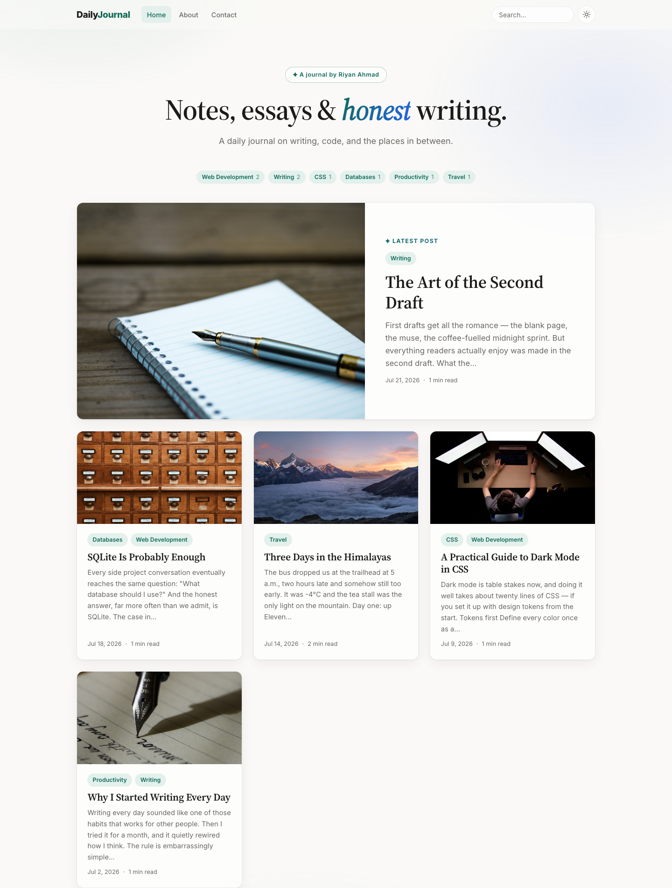
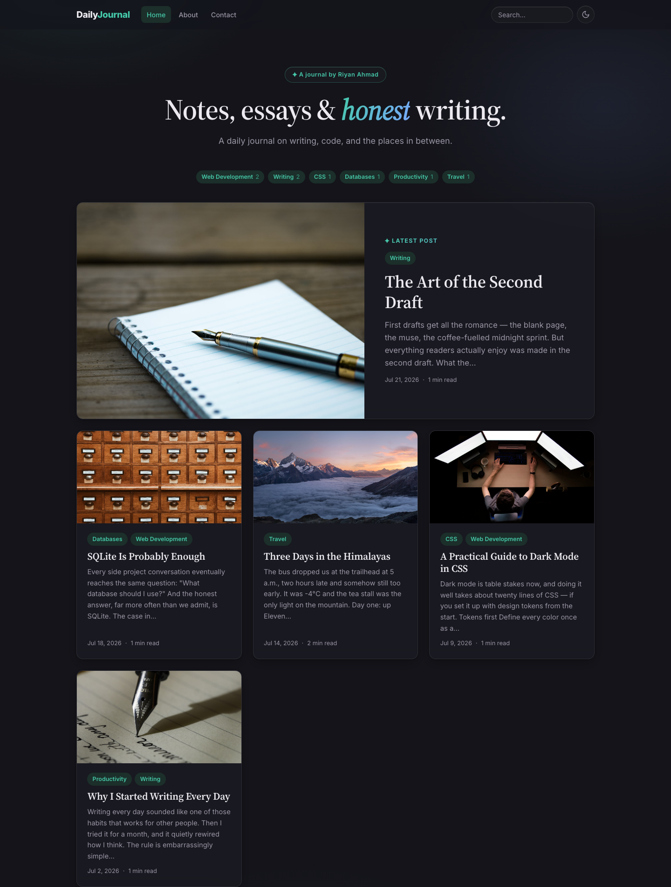
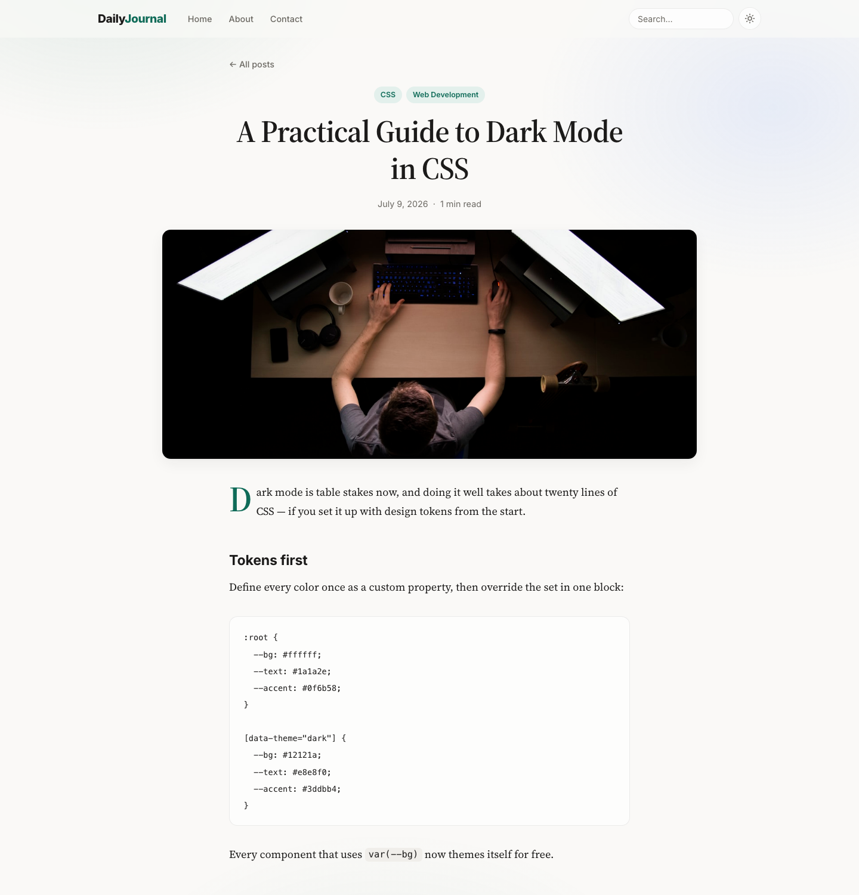

# ✍️ Daily Journal

A modern, professional blog application with a glassmorphism UI, built with **Express + EJS + SQLite** — no frontend framework, no build step, deployable for **$0/month**.


| Light | Dark |
|---|---|
|  |  |

<details>
<summary>📄 Article page</summary>



</details>

---

## Features

### Writing
- **Markdown posts** — headings, code blocks, blockquotes, lists, images, links
- **XSS-safe rendering** — content is sanitized after Markdown parsing (`marked` + `sanitize-html`); scripts and `javascript:` URLs are stripped
- **Auto everything** — excerpts, reading time (`~200 wpm`), and slug URLs (`/post/my-title`, duplicates become `my-title-2`) are generated on save
- **Cover images** — paste any image URL for rich post cards
- **Tags** — comma-separated on the compose form, normalized in the DB, browsable at `/tag/:slug`

### Reading
- **Featured post spotlight** — the latest post gets a full-width magazine-style card
- **Search** — full-text `LIKE` search across titles, excerpts, and content (special characters escaped)
- **Dark / light mode** — respects OS preference on first visit, remembers the user's toggle, zero flash-of-wrong-theme
- **Reading progress bar**, **drop caps**, and serif article typography tuned for long reads

### Admin
- **Session login** — bcrypt-hashed password, signed `cookie-session` (survives server restarts)
- **Full CRUD** — compose, edit, and delete from the browser; all admin routes guarded server-side
- **Single-admin model** — credentials seeded from environment variables

### UI / UX
- **Glassmorphism design** — frosted-glass cards, nav, and forms over a soft aurora gradient backdrop
- **Design-token CSS** — every color is a custom property; dark mode is one override block
- **Accessible** — skip-to-content link, visible focus rings, `aria` labels, reduced-motion support
- **Responsive** — single-column layout and adapted nav under 720px

---

## Tech stack

| Layer | Choice | Why |
|---|---|---|
| Server | [Express 4](https://expressjs.com) | Minimal, battle-tested |
| Templates | [EJS 3](https://ejs.co) | Server-rendered HTML, no build step |
| Database | [libSQL](https://github.com/tursodatabase/libsql) (`@libsql/client`) | SQLite dialect; **local file in dev**, **[Turso](https://turso.tech) free tier in prod** |
| Auth | `bcryptjs` + `cookie-session` | Hashed passwords, stateless signed sessions |
| Markdown | `marked` + `sanitize-html` | Fast parsing with strict output sanitization |
| Styling | Vanilla CSS (~700 lines) | Design tokens, glassmorphism, no framework |

---

## Project structure

```
app.js                  Entry point: middleware, sessions, routers, 404/500 handlers
├── db/
│   ├── database.js     libSQL client + idempotent schema init
│   └── seed.js         Seeds admin user + sample posts (npm run seed)
├── lib/
│   ├── markdown.js     renderMarkdown / makeExcerpt / readingTime
│   └── slugs.js        Slug generation with collision handling
├── models/
│   ├── posts.js        Post queries: list, get, search, create, update, delete
│   └── tags.js         Tag upsert, post↔tag sync, tag pages
├── middleware/
│   └── auth.js         requireAuth guard
├── routes/
│   ├── public.js       / · /post/:slug · /tag/:slug · /search · /about · /contact
│   └── admin.js        /admin/login · /compose · /admin/edit/:id · /admin/delete/:id
├── views/              EJS templates + partials (head, nav, footer, post-card)
├── public/
│   ├── css/styles.css  Full design system
│   └── js/theme.js     Theme toggle, nav shadow, reading progress
└── render.yaml         Render deployment blueprint
```

---

## Getting started

**Prerequisites:** Node.js ≥ 18

```bash
git clone https://github.com/dexterrxx31/my-blog-app.git
cd my-blog-app
npm install

cp .env.example .env      # then edit it — at minimum set ADMIN_PASSWORD

npm run seed              # creates admin user + 5 sample posts
npm run dev               # → http://localhost:3000
```

No database setup required locally — a SQLite file is created automatically at `data/blog.db`.

**Logging in:** click the small **Admin** link in the footer (or visit `/admin/login`) and use the credentials from your `.env`.

### Scripts

| Command | What it does |
|---|---|
| `npm run dev` | Start with auto-reload (nodemon) |
| `npm start` | Start for production |
| `npm run seed` | Upsert the admin user; insert sample posts if the DB is empty. Safe to re-run — also how you change the admin password |

---

## Environment variables

| Variable | Required | Purpose |
|---|---|---|
| `SESSION_SECRET` | ✅ | Signs the session cookie — use a long random string |
| `ADMIN_USERNAME` | ✅ (for seed) | Admin login name |
| `ADMIN_PASSWORD` | ✅ (for seed) | Admin login password (stored only as a bcrypt hash) |
| `TURSO_DATABASE_URL` | prod only | `libsql://…` URL from Turso. **Omit locally** to use `data/blog.db` |
| `TURSO_AUTH_TOKEN` | prod only | Turso auth token |
| `PORT` | – | Server port (default `3000`) |
| `NODE_ENV` | prod only | Set to `production` to enable secure cookies |

---

## Routes

| Method | Path | Auth | Purpose |
|---|---|---|---|
| GET | `/` | – | Home: hero + featured post + card grid |
| GET | `/post/:slug` | – | Article page |
| GET | `/tag/:slug` | – | Posts filtered by tag |
| GET | `/search?q=` | – | Search results |
| GET | `/about`, `/contact` | – | Static pages |
| GET/POST | `/admin/login` | – | Login form / submit |
| POST | `/admin/logout` | ✅ | End session |
| GET/POST | `/compose` | ✅ | New post form / create |
| GET/POST | `/admin/edit/:id` | ✅ | Edit form / update |
| POST | `/admin/delete/:id` | ✅ | Delete post |

Unknown routes render a styled 404; unexpected errors render a styled 500.

---

## Database schema

```sql
posts      (id, title, slug UNIQUE, content, html, excerpt,
            cover_image_url, reading_time, created_at, updated_at)
tags       (id, name UNIQUE, slug UNIQUE)
post_tags  (post_id, tag_id)          -- many-to-many junction
users      (id, username UNIQUE, password_hash)
```

`content` stores the Markdown source; `html` caches the sanitized rendered output so the read path never re-parses.

---

## Deployment (free: Render + Turso)

The stack deploys for $0/month: [Render](https://render.com)'s free web service + [Turso](https://turso.tech)'s free database tier.

1. **Turso** — create a database at [app.turso.tech](https://app.turso.tech); copy its `libsql://` **URL** and generate an **auth token**.
2. **Seed production** — run once from your machine:
   ```bash
   TURSO_DATABASE_URL="libsql://…" TURSO_AUTH_TOKEN="…" npm run seed
   ```
   (Or put both values in `.env` and just run `npm run seed`.)
3. **Render** — *New → Blueprint* → connect this repo. Render reads [`render.yaml`](render.yaml) and prompts for the two Turso values; everything else is preconfigured.

Every push to `main` auto-deploys.

> **Note:** Render's free tier sleeps after 15 minutes of inactivity — the first visit afterwards takes ~30 s to wake. Post data always persists in Turso.

---

## Security notes

- All user-visible output is HTML-escaped (`<%= %>`); the only unescaped render is the post body, which passes through `sanitize-html` with an allowlist first
- SQL is fully parameterized; search input additionally escapes `LIKE` wildcards
- Passwords are bcrypt-hashed (cost 12); sessions are `httpOnly` + `SameSite=Lax` signed cookies, `Secure` in production
- State-changing routes are POST-only and auth-guarded server-side

---

## License

ISC © [Riyan Ahmad](https://github.com/dexterrxx31)
